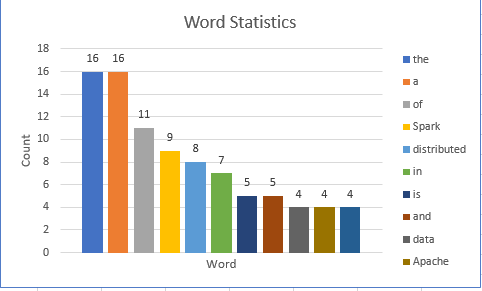

# Spark Word Count (Spark Wikipedia)
## About Me

## Objective

## Data Source
I have taken the data from overview of spark on wikipedia. Below is the attached link to the data.  
source: [Spark Wikipedia](https://en.wikipedia.org/wiki/Apache_Spark)

## Scala Commands
1.  Reading data from textfile
    ```Scala
    val importeddata = sc.textFile("Spark_Overview.txt")
    ```
2. Splitting data into words and loading the result into another dataset
    ```Scala
    val importeddatasplit = importeddata.flatMap(str => str.split(" "))
    ```
3. Mapping Each word with 1 to perform reduce algorithm 
    ```Scala
    val importeddatamap1 = importeddatasplit.map((_,1))
    ```
3. Reducing the output from mapper using recursive addition 
    ```Scala
    val resafterreducer = importeddatamap1.reduceByKey( (curr,prev) => curr + prev )
    ```
3. Interchanging the key-value pair using map function and storing the generated result in new dataset called result 
    ```Scala
    val result = resafterreducer.map{case (key,value) => (value,key) }
    ```
3. Sorting the generated dataset in previous step and storing in a new dataset
    ```Scala
    val result1 = result.sortByKey(false)
    ```
3. Store the output to a directory
    ```Scala
    result1.map(_.toString()).saveAsTextFile("output")
    ```
## Results

<link href="style.css" rel="stylesheet" />

| Count | Word        |
|-------|-------------|
| 16    | the         |
| 16    | a           |
| 11    | of          |
| 9     | Spark       |
| 8     | distributed |
| 7     | in          |
| 5     | is          |
| 5     | and         |
| 4     | data        |
| 4     | Apache      |
| 4     | cluster     |

## Published Page: [Link](https://santhoshbonala.github.io/Spark__WordCount/)


